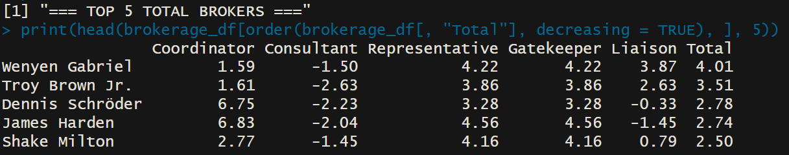

## Table of Contents
1. [Project Overview](#project-overview)
2. [Part I: NBA Draft Class Network Analysis](#part-i-nba-draft-class-network-analysis)
   - [Narrative Summary](#narrative-summary)
   - [Data Setup and Description](#data-setup-and-description)
   - [Network Visualization](#network-visualization)
   - [Draft Analysis Summary](#draft-analysis-summary)
3. [Part II: NBA Brokerage Analysis](#part-ii-nba-brokerage-analysis)
   - [Brokerage Overview](#brokerage-overview)
   - [Setup Process](#setup-process)
   - [Creating Graph Objects](#creating-graph-objects)
   - [Brokerage Analysis](#brokerage-analysis)
   - [Results and Discussion](#results-and-discussion)
4. [Final Summary](#final-summary)

## Project Overview

This project presents a comprehensive analysis of NBA player networks using two complementary approaches: draft class trajectory analysis and brokerage role identification. The first part examines how players from the same draft year connect throughout their professional careers, while the second part identifies key "broker" players who serve as connectors across different team communities. Together, these analyses provide insights into career patterns, player mobility, and the interconnected nature of NBA rosters.

---

## Part I: NBA Draft Class Network Analysis

### Narrative Summary

This analysis explores NBA draft classes through network analysis, examining how players from the same draft year connect throughout their professional careers. The network is constructed by linking players who have been teammates on the same team during the same season, creating a web of connections that reveals career trajectories and player movement patterns within draft cohorts.

The analysis focuses on the 2018 NBA Draft class, using game log data from 2018-2024 to track player careers and team associations. By visualizing these connections as a network graph, we can identify clustering patterns, understand career longevity differences, and observe how draft class members remain connected through shared team experiences over time.

### Data Setup and Description

#### Required Packages and Setup
```{r setup1, eval=FALSE}
# Install required packages
install.packages("remotes")
remotes::install_github("abresler/nbastatR", force = TRUE)
remotes::install_version("future", version = "1.15.1")

# Load libraries
library(nbastatR)
library(future)
library(dplyr)
library(tidyr)
library(igraph)
library(ggraph)
library(ggplot2)

# Setup for large data processing
Sys.setenv(VROOM_CONNECTION_SIZE = 131072 * 10)
plan(sequential)

# Get game logs from 2018 to 2024 
logs <- game_logs(seasons = 2018:2024)
```

#### Data Description
**Data Source:** NBA game logs accessed through the nbastatR package, which pulls from official NBA APIs  
**Collection Period:** 2018-2024 NBA seasons  
**Access Link:** Data is retrieved through the `nbastatR` package in R

**Network Structure:**
- **Vertices (Nodes):** Individual NBA players from the 2018 draft class
- **Edges (Connections):** Created when two players from the same draft class played on the same team during the same season
- **Node Attributes:** Average points per game and total games played across career
- **Data Collectors:** NBA official statistics, accessed via nbastatR package

### Network Visualization

```{r draft_network, eval=FALSE}
# Function to create NBA Draft Class Network Graphs
draft_class_network <- function(draft_years, logs) {
  
  # Get draft class players
  draft_data <- drafts(draft_years = draft_years, nest_data = FALSE, return_message = TRUE)
  
  # Filter logs for draft class players
  career_logs <- logs %>%
    filter(namePlayer %in% draft_data$namePlayer)
  
  # Create player-team-season dataframe
  player_team_season <- career_logs %>%
    select(namePlayer, slugTeam, yearSeason) %>%
    distinct()
  
  # Build edges, pair players on same team in same season
  edges_list <- list()
  
  # Get unique (team, season) combinations
  team_seasons <- unique(player_team_season[, c("slugTeam", "yearSeason")])
  
  # Loop over all team-season combinations
  for (i in 1:nrow(team_seasons)) {
    # Get current team and season
    team <- team_seasons$slugTeam[i]
    season <- team_seasons$yearSeason[i]
    
    # Get players on this team for this season
    players_in_team_season <- player_team_season %>%
      filter(slugTeam == team, yearSeason == season) %>%
      pull(namePlayer)
    
    # If 2 or more players, create edges (all possible pairs)
    if (length(players_in_team_season) >= 2) {
      player_combos <- combn(players_in_team_season, 2)
      
      # Store edges as dataframe
      edges_list[[length(edges_list) + 1]] <- data.frame(
        from = player_combos[1, ],
        to = player_combos[2, ],
        stringsAsFactors = FALSE
      )
    }
  }
  
  # Combine all edges into one data frame
  edges <- do.call(rbind, edges_list)
  
  # Build igraph object
  g <- graph_from_data_frame(edges, directed = FALSE)
  
  # Summarize player stats, average points, assists, total rebounds, minutes and games played
  career_stats <- career_logs %>%
    group_by(namePlayer, yearSeason) %>%
    summarize(
      pts = mean(pts, na.rm = TRUE),
      ast = mean(ast, na.rm = TRUE),
      treb = mean(treb, na.rm = TRUE),
      minutes = mean(minutes, na.rm = TRUE),
      games_played = n_distinct(idGame),
      .groups = 'drop'
    )
  
  # Aggregate stats across all season for each player
  node_stats <- career_stats %>%
    group_by(namePlayer) %>%
    summarize(
      avg_pts = mean(pts, na.rm = TRUE),
      total_games = sum(games_played),
      .groups = 'drop'
    )
  
  # Add node attributes
  V(g)$avg_pts <- node_stats$avg_pts[match(V(g)$name, node_stats$namePlayer)] # avg_pts = average points per game across career
  V(g)$total_games <- node_stats$total_games[match(V(g)$name, node_stats$namePlayer)] # total_games = total games played across career
  
  #Plot graph with ggraph
  ggraph(g, layout = "fr") + # Use Fruchterman-Reingold layout (spread out nicely)
    geom_edge_link(alpha = 0.4, color = "gray80") + # Draw edges (gray lines, semi-transparent)
    geom_node_point(aes(size = total_games, color = avg_pts), alpha = 0.9) + # Draw nodes (size = games played, color = avg pts)
    geom_node_text(aes(label = name), repel = TRUE, size = 3) + # Label nodes (with repel to avoid overlapping text!)
    scale_color_viridis_c(option = "C", direction = -1, name = "Avg PPG") + # Color scale = viridis color palette (C), reversed
    scale_size(range = c(3, 10), name = "Total Games Played") + # Node size scale
    theme_void() + # No background / axis
    ggtitle(paste(draft_years, "Draft Class Career Trajectory Network (Spread and Readable)")) + # Title of the plot
    theme(plot.title = element_text(hjust = 0.5, size = 16, face = "bold")) # Title formatting (centered, bold)
}

# Run function
draft_class_network(2018, logs)
```

The visualization uses a force-directed layout where node size represents career longevity (total games played) and color intensity shows scoring performance (average points per game). Connections between players indicate they were teammates at some point during their careers.

### Draft Analysis Summary

This network analysis reveals important insights about NBA draft class career trajectories and player movement patterns. The visualization effectively shows how players from the same draft year remain connected through shared team experiences, with some players serving as central hubs who have played with many of their draft class peers. The network structure can indicate player mobility, career longevity, and the interconnected nature of NBA rosters.

---

## Part II: NBA Brokerage Analysis

### Brokerage Overview

This second analysis explores "broker" players using Gould-Fernandez Brokerage analysis with network science methods. We examine how players connect different team communities and identify key connective roles within the NBA ecosystem. The goal is to visualize and interpret player dynamics through graph structures, focusing on players who serve as bridges between different groups.

Our main packages include `nbastatR` for real NBA data, and `igraph`, `sna`, and `dplyr` for data wrangling, network creation, and brokerage analysis. This work helps illustrate team structures and player centrality for coaches, analysts, and fans.

### Setup Process

```{r setup2, eval=FALSE}
# Use these in your console before downloading the other packages
# install.packages("remotes")
# remotes::install_github("abresler/nbastatR", force = TRUE)
```

#### Packages Used
```{r packages, eval=FALSE}
# Dataset package
library(nbastatR)
# Packages needed
library(devtools)
library(dplyr)
library(future)
library(ggplot2)
library(igraph)
library(knitr)
# For brokerage analysis
library(sna)
```

#### Reading in the Data Sets
```{r datasets, eval=FALSE}
# Adjust VROOM buffer size for large data!
Sys.setenv(VROOM_CONNECTION_SIZE = 131072 * 10)
# Change season to anything from (ex 2020:2024, from 2020 to 2024 seasons)
game_data <- game_logs(seasons = 2020:2024)
```

### Creating Graph Objects

```{r graphObjects, eval=FALSE}
# Create player-to-player network based on shared teams
cat("Creating player teammate network...\n")
# Unique player-team-season combos
player_teams <- game_data %>%
  select(namePlayer, slugTeam, slugSeason) %>%
  distinct()
  
# Create teammate pairs per team-season
teammate_pairs <- player_teams %>%
  group_by(slugTeam, slugSeason) %>%
  filter(n() > 1) %>%
  do({
    players <- .$namePlayer
    expand.grid(
      player1 = players,
      player2 = players,
      stringsAsFactors = FALSE
    ) %>%
    filter(player1 != player2)
  }) %>%
  group_by(player1, player2) %>%
  summarise(
    shared_teams = n(),
    teams = paste(unique(paste(slugTeam, slugSeason)), collapse = ", "),
    .groups = "drop"
  ) %>%
  filter(shared_teams >= 1)
cat("Teammate connections created:", nrow(teammate_pairs), "\n")
```

#### Filtering
```{r filtering, eval=FALSE}
cat("Filtering connections between players...\n")
# Most connected players
player_connections <- teammate_pairs %>%
  group_by(player1) %>%
  summarise(total_teammates = n(), .groups = "drop") %>%
  arrange(desc(total_teammates))
# Filter top 100 players by connections
top_players <- head(player_connections$player1, 100)
filtered_network <- teammate_pairs %>%
  filter(player1 %in% top_players & player2 %in% top_players)
# Creates graph + simplify (remove loops and multiple edges)
players_network <- graph_from_data_frame(filtered_network, directed = FALSE)
players_network <- simplify(players_network)
```

```{r detection, eval=FALSE}
# Detect communities using Louvain algorithm
communities <- cluster_louvain(players_network)
V(players_network)$community <- membership(communities)
# Calculate betweenness centrality
between <- igraph::betweenness(players_network)
# Create a data frame for betweenness results
bet.dat <- data.frame(
  player = V(players_network)$name,
  between = between
)
# Print top 10 players by betweenness
cat("=== (Betweenness Centrality) ===\n")
print(head(bet.dat[order(bet.dat$between, decreasing = TRUE),], 10))
# Community summary
cat("\n=== COMMUNITY STRUCTURE ===\n")
cat("Modularity:", round(modularity(communities), 3), "\n")
# Get membership vector
membership_vec <- membership(communities)
# Members of community
for(i in 1:min(5, max(membership_vec))) {
  community_players <- V(players_network)$name[membership_vec == i]
  cat("Community", i, ":", paste(head(community_players, 5), collapse = ", "), 
      ifelse(length(community_players) > 5, "...", ""), "\n")
}
```

### Brokerage Analysis

Brokerage analysis identifies players who connect others across different groups. It measures 5 broker types:

- **Coordinator:** Connects players within same group (A→A→A)
- **Consultant:** Outsider connecting group members (A→B→A)
- **Gatekeeper:** Controls incoming connections (A→B→B)
- **Representative:** Controls outgoing connections (A→A→B)
- **Liaison:** Connects different groups (A→B→C)

Values are normalized and rounded to two digits. Z-scores show statistical significance - values >1.96 are unusually high brokers for that role.

```{r brokerage, eval=FALSE}
# MAKE SURE TO RUN THIS LINE, as it will conflict with functions from earlier packages
install.packages("intergraph", dependencies = TRUE)
# PACKAGES
library(intergraph)
library(statnet)
library(knitr)
library(dplyr)

# Convert igraph to sna network
snaNetwork <- asNetwork(players_network)
# Confirm the network size matches igraph vertex count
stopifnot(network.size(snaNetwork) == length(V(players_network)))

# Assign communities as vertex attributes
community_named <- membership(communities)
names(community_named) <- V(players_network)$name

# Assign community attribute to the network vertices by matching names
set.vertex.attribute(
  snaNetwork,
  "community",
  value = community_named[get.vertex.attribute(snaNetwork, "vertex.names")]
)

# Check to see if community listed
print(table(get.vertex.attribute(snaNetwork, "community")))

# Create dataframe from brokerage analysis result, 2 DIGITS
brokerage_df <- round(brokerage(snaNetwork, cl=get.vertex.attribute(snaNetwork, "community"))$z.nli, 2) 

# Column names readability
colnames(brokerage_df) <- c(
  "Coordinator",     # was w_I
  "Consultant",      # was w_O
  "Representative",  # was b_IO
  "Gatekeeper",      # was b_OI
  "Liaison",         # was b_O
  "Total"            # was t
)

# Show all data sorted by Total
print("=== ALL PLAYERS BY TOTAL BROKERAGE ===")
print(brokerage_df[order(brokerage_df[, "Total"], decreasing = TRUE), ])

# Show top 5 by Total
print("=== TOP 5 TOTAL BROKERS ===")
print(head(brokerage_df[order(brokerage_df[, "Total"], decreasing = TRUE), ], 5))

# Show top 3 players in each category
print("=== TOP 3 PLAYERS BY CATEGORY ===")
for(col in colnames(brokerage_df)) {
 print(paste("=== TOP 3", col, "==="))
 sorted <- brokerage_df[order(brokerage_df[, col], decreasing = TRUE), ]
 top_3 <- head(sorted[, col, drop = FALSE], 3)
 for(i in 1:nrow(top_3)) {
   print(paste(i, ".", rownames(top_3)[i], "(", top_3[i, 1], ")"))
 }
 writeLines("")  # blank line
}
```

### Results and Discussion

#### Key Findings

The brokerage analysis reveals interesting patterns about player roles in the NBA ecosystem. For example, when analyzing seasons 2016-2024, Jeff Green emerged as a top broker, supporting the narrative from basketball communities about his value as a journeyman player:

> "Because even though Jeff Green's journeyman path through the NBA has been un-sexy, he's been able to keep a job in the league for 15 seasons, playing for eleven teams, and collecting a lot of paychecks. Jeff Green is the opposite of a 'star' and there's actually something cool about that." - BasketballxFeelings


This analysis validates that journeyman players like Jeff Green, Wenyen Gabriel, and Troy Brown Jr. often serve crucial connector roles, bridging different team communities throughout their careers.

Interestingly, the analysis also revealed that star players can have high brokerage scores. James Harden, despite being an elite scorer, showed high brokerage totals (2.74 in the 2020-2024 window), indicating that even superstars can serve as important connectors across multiple teams and communities.



#### Data Sources and References

**Resources used for brokerage analysis:**
- [R Documentation: brokerage function](https://www.rdocumentation.org/packages/sna/versions/2.8/topics/brokerage)
- [RStudio Pubs: Brokerage Roles Analysis](https://rstudio-pubs-static.s3.amazonaws.com/320424_f1e3875c90dd489983f92c7628164bdc.html#Brokerage_Roles)

**Community discussions:**
- [Reddit: Jeff Green NBA Legend Discussion](https://www.reddit.com/r/nbadiscussion/comments/15jadhd/jeff_green_is_kinda_an_nba_legend/)
- [Reddit: Dennis Schroder Running Out of Options](https://www.reddit.com/r/nba/comments/oyk95z/dennis_schroder_is_running_out_of_options_on/)
- [Reddit: Dennis Schroder Team Changes](https://www.reddit.com/r/nba/comments/1hegyvq/slater_dennis_schroder_has_now_changed_teams/)

---

## Final Summary

This comprehensive network analysis demonstrates how two different approaches can provide complementary insights into NBA player dynamics. The draft class analysis reveals how players from the same cohort maintain connections throughout their careers, while the brokerage analysis identifies key connector players who bridge different team communities.

Together, these analyses show that network science provides a unique lens for understanding sports careers beyond traditional statistical measures. By examining both cohort connections and brokerage roles, we can identify patterns in team building, player movement, and career development that might not be apparent through conventional analysis.

The findings highlight the value of both star players and journeyman players in different network roles. While stars may dominate traditional statistics, journeyman players often serve crucial functions as connectors and bridges within the broader NBA ecosystem. This approach offers valuable insights for understanding how professional sports leagues function as complex social and professional networks.

**Key Takeaways:**
- Draft class connections persist throughout NBA careers, creating lasting professional networks
- Journeyman players often serve as crucial network brokers, connecting different team communities  
- Even star players can have high brokerage scores, indicating their connector roles beyond just performance
- Network analysis reveals hidden patterns in player movement and team dynamics
- These insights could inform team building strategies, player evaluation, and understanding of league dynamics